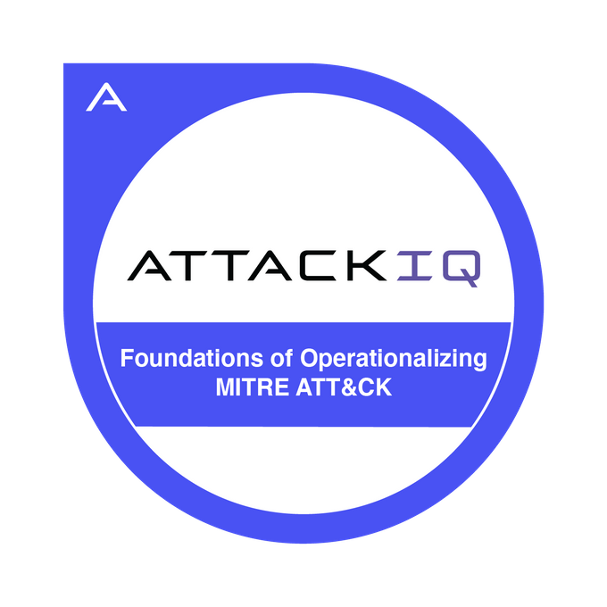

# Olumayowa Taiwo

I'm a DevOps Engineer with years of professional experience providing solutions to companies or businesses of different scales in industries such as Finance, Insurance, Crypto, Education, and Healthcare. My cloud provider of choice is AWS (whose tools, platforms, and services I've executed many projects with), and I've also provided solutions using GCP, OVH, Heroku, and Digital Ocean. I've previously worked as a member of multiple teams, an individual contributor, as a proxy, and also as a consultant. I'm presently taking CyberSecurity courses to enable me implement the best security practices in all areas of my work.

 

  
  
   

 

---

### Projects

 
 

  

    
    
    
    
    
    
    

 
 

### Certifications

  
  
  
  
  
  
  
  

 
 
 

### Cloud Providers

<a href="https://www.heroku.com/">

  
 
 

### Programming Languages and Scripting

 
 

### Tools

 
 

### VCS & CI/CD

 
 

### Infrastructure as Code

 
 

### Monitoring & Testing

 
 

### Project Management

 
 

### Libraries and Frameworks

 
 

### Databases

 
 
 

### Markup

 
 

### Stats

    

 
 

---

### My Journey
   I started out as a student of Mechanical Engineering who loved gadgets and electronics a little too much, so I would look for ways to improve them and make them way better than they were designed to perform (e.g. overclocking graphics cards and processors, porting drivers from one device to another, upgrading hardware, etc). I already knew how to repair electronics and make custom electronics such as power amplifiers, sound equalizers, active filters (sallen-key, butterworth, chebyshev), and all sorts of other DIY electronics.
  I got very interested in mobile phones so I started working on them in the days of Android Eclairs and iPhone 4. While testing custom ROMs on Android phones and jailbreakking iPhones, I was introduced to Python 2, Android Debugging Bridge (ADB), JTAG, and Linux (Ubuntu).
  I was able to implement projects such as E-learning systems for companies with the knowledge of Linux and Python 2 that I had, then I switched to PHP and WordPress because it looked interesting to me. I transitioned afterwards to writing desktop apps with C# and packaging them with InstallShield. This wasn't long-lived as I later switched to JavaScript (React and Node.js) and Java. 
  My switch to DevOps happened over 5 years ago when a mentor gave me a Raspberry Pi 3b+ and asked me to run experiments on it and try to break it. I made many projects with it (one of them is Raspotify), then I got to the point where I was able to host a static website on it, and eventually run Kubernetes (MicroK8s). That's how my DevOps Journey started.
  
 
 

